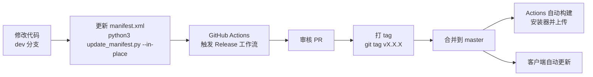

# Path of Building Community — 启动与打包指南

## 项目概述

Path of Building Community 是一个基于 Lua 的《流放之路》(Path of Exile) 离线 BD 规划器，使用自定义 2D 图形引擎 (SimpleGraphic) 构建的 Windows 桌面应用。

## 环境要求

### 运行环境
- Windows 操作系统
- 无需额外安装运行时，所有依赖已打包在 `runtime/` 目录中

### 开发环境（可选）
- Lua 5.1 / LuaJIT
- Python 3.7+（用于更新 manifest、生成安装器等脚本）

## 一、启动项目

### 方式一：直接运行（推荐）

直接双击运行 `runtime/Path of Building.exe` 即可：

```bash
# 或在命令行中：
"runtime/Path of Building.exe"
```

`runtime/` 目录下包含完整的运行环境：
- `Path of Building.exe` — 主程序
- `SimpleGraphic.dll` — 自定义 2D 图形引擎
- `lua51.dll` — LuaJIT 5.1 运行时
- `glfw3.dll` — 窗口管理
- 其他依赖 DLL（`libcurl.dll`、`zstd.dll`、`re2.dll` 等）

### 方式二：从源码运行

程序启动时自动加载 `src/` 目录下的 Lua 源码。因此开发时只需：

1. 确保 `runtime/` 目录结构完整（如果缺失，解压 `runtime-win32.zip`）
2. 修改 `src/` 下的 `.lua` 文件
3. 重启 `runtime/Path of Building.exe`，改动即刻生效

### 方式三：Docker 环境（仅用于测试，不支持 GUI）

```bash
docker compose up -d
```

Docker 镜像包含 Lua 5.1、LuaJIT、busted 测试框架等，用于 CI 跑测试套件。**不能用来运行 GUI 程序。**

运行测试：

```bash
docker compose exec pob busted
```

## 二、开发模式

程序启动时如果检测到 `src/` 目录存在，会自动进入开发模式（dev mode），此时：
- 直接加载 `src/` 下的源码文件，而非内嵌副本
- 修改源码后重启程序即生效，无需重新编译

配置文件 [manifest.cfg](../manifest.cfg) 定义了各部分的文件路径：
- `[default]` — 文档类文件（`changelog.txt`、`help.txt` 等）
- `[runtime]` — 运行时二进制文件（DLL、EXE）
- `[program]` — 程序源码（`src/` 下的 Lua 文件）
- `[tree]` — 天赋树数据（`src/TreeData/`）

## 三、打包与发版

### 3.1 更新 manifest.xml

每次发版前，若修改过任何文件，需要重新生成文件校验清单：

```bash
python3 update_manifest.py --in-place
```

此脚本会：
1. 读取 [manifest.cfg](../manifest.cfg) 中的文件配置
2. 扫描各部分目录下的所有文件
3. 重新计算每个文件的 SHA1 哈希值
4. 更新 [manifest.xml](../manifest.xml)（包含 `<Version>`、`<Source>`、`<File>` 节点）

客户端自动更新时依赖这些哈希值做增量下载比对。

### 3.2 正式发版流程（通过 GitHub Actions）

1. 确保所有改动已合并到 `dev` 分支
2. 前往 [Actions → "Release next version"](https://github.com/PathOfBuildingCommunity/PathOfBuilding/actions/workflows/release.yml)
3. 点击 **"Run workflow"**，填写：
   - 从 `dev` 分支运行
   - 填写上一个 tag（用于生成 changelog 对比）
   - 填写新版本号（遵循[语义化版本](https://semver.org/)）
4. Action 自动生成 PR，包含：
   - 自动生成的 Release Notes
   - 更新后的 `changelog.txt` 和 `CHANGELOG.md`
5. **审核 PR**，根据需要调整内容
6. 如果修改了 PR 中的文件，重新运行 `python3 update_manifest.py --in-place`
7. **打 tag 并推送**：
   ```bash
   git tag v2.66.1
   git push --tags
   ```
8. 合并 PR 到 `master`，客户端将在几分钟后检测到更新

### 3.3 Windows 安装器构建

安装器通过另一个独立仓库构建：[PathOfBuilding-Installer](https://github.com/PathOfBuildingCommunity/PathOfBuildingInstaller)（需 maintainer 权限）。

**前置条件：**
- Python 3.7+
- NSIS 3.07+（`makensis` 需在 PATH 中）
- Git 2.21.0+

**构建步骤：**
```bash
git clone https://github.com/PathOfBuildingCommunity/PathOfBuildingInstaller.git
cd PathOfBuildingInstaller
python make_release.py
```

生成的安装器位于 `./Dist` 目录。

该流程在 GitHub 上发布 Release 时由 [installer.yml](../.github/workflows/installer.yml) 自动触发，上传产物到 Release 页面。

### 3.4 Beta 版本自动构建

Beta 版本由 [beta.yml](../.github/workflows/beta.yml) 自动维护：
- **触发条件**：每周五 UTC 0:00 定时运行 / `master` 有推送时 / 手动触发
- **流程**：从 `dev` 分支生成 beta 构建 → 更新 `manifest.xml` → force push 到 `beta` 分支
- 版本号会附带 commit hash 后缀（如 `2.66.1-a1b2c3d`），用于区分不同 beta 版本

### 3.5 发版流程总结



## 四、相关文件索引

| 文件 | 说明 |
|------|------|
| [runtime/Path of Building.exe](../runtime/Path%20of%20Building.exe) | 主程序入口 |
| [manifest.xml](../manifest.xml) | 文件清单（版本号 + 各文件 SHA1） |
| [manifest.cfg](../manifest.cfg) | 清单配置文件（定义各部分的文件范围） |
| [update_manifest.py](../update_manifest.py) | 清单生成脚本 |
| [runtime-win32.zip](../runtime-win32.zip) | 运行时环境压缩包 |
| [Dockerfile](../Dockerfile) | Docker 测试环境镜像 |
| [.github/workflows/release.yml](../.github/workflows/release.yml) | 发版工作流 |
| [.github/workflows/installer.yml](../.github/workflows/installer.yml) | 安装器构建工作流 |
| [.github/workflows/beta.yml](../.github/workflows/beta.yml) | Beta 版本自动构建工作流 |
| [RELEASE.md](../RELEASE.md) | 发版详细说明 |
| [CONTRIBUTING.md](../CONTRIBUTING.md) | 贡献指南 |
| [docs/rundown.md](rundown.md) | 代码库结构概览 |
